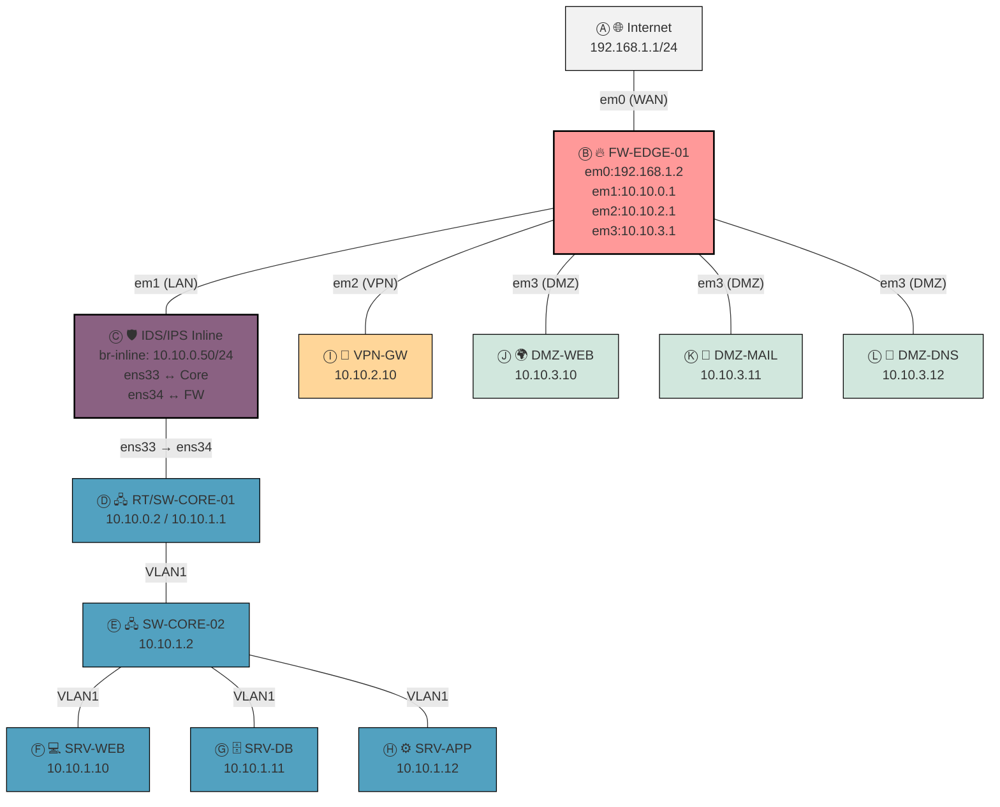

<i></b><h2>  🌐 Laboratorio de Red Profesional – VPN + IDS/IPS (documentation in Spanish)</i></b></h2> 

<i></b>📖 Descripción del Proyecto</i></b>

Soy ivansalpe y he diseñado este laboratorio de red con el objetivo de demostrar mis habilidades en seguridad informática, redes y virtualización. La topología implementada incluye:

- 🔥 Un firewall de perímetro (FW-EDGE-01) con OPNsense.

- 🛡️ Un IDS/IPS inline (Suricata) dedicado, que inspecciona y bloquea tráfico en tiempo real.

- 🖧 Un núcleo de red con routers/switches virtualizados para segmentar VLANs.

- 🌍 Una DMZ para servicios públicos expuestos.

- 🔑 Una VPN (IPsec/IKEv2) para acceso remoto seguro.

Este proyecto busca simular un entorno empresarial real, combinando seguridad perimetral, segmentación y monitorización avanzada de amenazas.

---

<i></b>📊 Topología de Red</i></b>

---

<i></b>🛠️ Componentes del Laboratorio</i></b>
| Componente                | Función / Rol                                                                 |
|----------------------------|-------------------------------------------------------------------------------|
| FW-EDGE-01 (OPNsense)      | Firewall perimetral, NAT, control de tráfico, terminación de VPN IKEv2/IPsec |
| IDS/IPS Inline (Suricata)  | Inspección profunda de paquetes, aplicación de reglas ET Open, bloqueo de amenazas |
| RT/SW-CORE-01              | Routing interno y manejo de VLANs entre LAN, DMZ y VPN                       |
| SW-CORE-02                 | Switch de distribución en VLAN1                                              |
| Servidores LAN             | WEB, DB, APP — servicios internos críticos                                   |
| Servidores DMZ             | WEB, MAIL, DNS — servicios expuestos y monitorizados                         |
| VPN-GW / Clientes VPN      | Acceso remoto seguro, con opción de NAT hacia Internet                       |

---

<i></b>🎯 Objetivos del Proyecto</i></b>

🔹 Simular un entorno empresarial real con seguridad perimetral y segmentación de red.

🔹 Demostrar habilidades en:

- 🔐 VPNs seguras (IKEv2/IPsec)

- 🛡️ Detección y respuesta ante amenazas (Suricata)

- 🖧 Diseño y operación de VLANs

🔹 Documentar el laboratorio de forma clara y profesional para portafolios

---

<i></b>🛠️ Modos de Operación</i></b>

- FW-EDGE-01: Segmentación de red, NAT, VPN IKEv2, reglas de firewall

- IDS/IPS Inline: Análisis y bloqueo de tráfico LAN/DMZ/VPN, reglas ET Open

- Core / Switches: VLANs separadas (LAN, VPN, DMZ) y enrutamiento interno

- Servidores LAN y DMZ: Servicios internos y públicos, protegidos por FW e inspeccionados por IDS/IPS

- VPN-GW / Clientes VPN: Conexión remota segura, NAT opcional para Internet

---

<i></b>📝 Manual Paso a Paso</i></b>

1️⃣ FW-EDGE-01 (OPNsense)

[Parte Firewall](docs/01_firewall.md)

2️⃣ IDS/IPS Inline (Suricata) 

[Parte IDSs-IPS](docs/02_ids-ips.md)

3️⃣ Core Router/Switch y servidores internos(VLAN)  

[Parte Router](docs/03a_router.md)

[Parte Switch](docs/03b_switch.md)

4️⃣ VPN-GW - Clientes VPN 

[Parte VPN](docs/04_vpn.md)

5️⃣ DMZ   

[Parte DMZ](docs/05_dmz.md)

---

<i></b>🧾 Notas Finales</i></b>

- IDS/IPS en modo inline entre FW y Core → inspección total de tráfico.

- VLANs separadas para LAN (10.10.1.0/24), DMZ (10.10.3.0/24), VPN (10.10.2.0/24).

- FW-EDGE-01 gestiona VPN remoto y NAT si es necesario para acceso a Internet.

- Logs de Suricata y FW activos para auditoría y depuración.

- Topología refleja entorno real de empresa, perfecta para portafolios de redes y seguridad.
